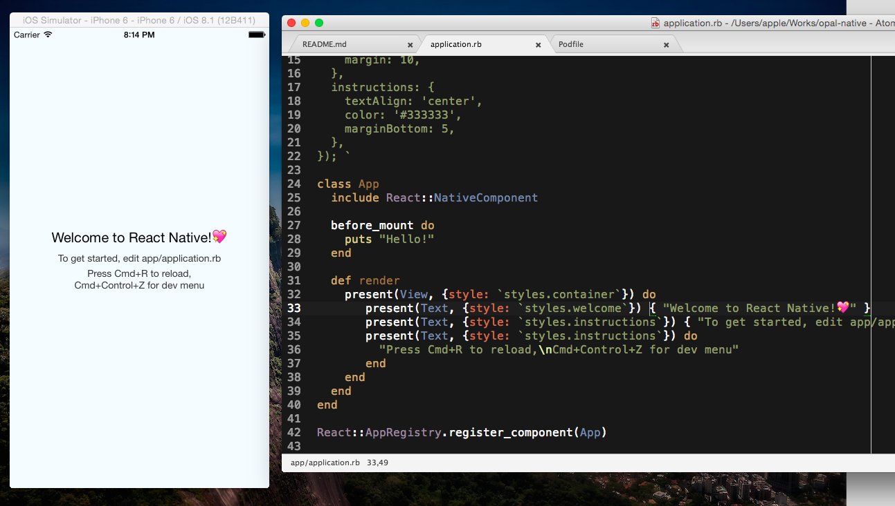

# Opal Native - React Native in Ruby

> JavaScript is an implementation detail.
> 
> -- [Why React Native Matters](http://joshaber.github.io/2015/01/30/why-react-native-matters/)

## Motivation

To provide a Ruby-friendly tool chain (this doesn't require node / npm) and wrapper over [React Native](http://facebook.github.io/react-native/) API. :sparkling_heart:

## Dependency

* [Opal Ruby](http://opalrb.org) is used as Ruby transpiler to transpile your Ruby code intro JavaScript.
* [react.rb](https://github.com/zetachang/react.rb) is a React.js providing basic DSL support in Ruby over the original JS API.

## Usage

1. Clone or download this project
2. `bundle install`
3. `bundle exec pod install` to install iOS dependency
4. `open SampleApp.xcworksapce` to launch Xcode
5. `bundle exec thin -R config.ru start -p 8081` to start packaging server
6. Build & Run

Note: Switch port other than 8081 is not allowed currently.

### Debug

1. `Ctrl + Command + Z` to toggle menu, and select "Enable debugging".
2. Open `http://localhost:8081/` in  Chrome or Safari to debug in inspector (haven't test in Firefox yet)
3. For details, see [Debugging Tutorial of React Native](http://facebook.github.io/react-native/docs/debugging.html)

## TODO

- [ ] Source map is broken
- [ ] Publish as a gem
- [ ] Add project generator or provide Xcode template
- [ ] Rewrite the original Movie.app example

## Contributions

This project is currently in proof of concept stage, so discussion, bug report and PR are really welcome :wink:.

## Contact

[David Chang](http://github.com/zetachang)
[@zetachang](https://twitter.com/zetachang)

## License

opal-native is available under the MIT license. See the LICENSE file for more info.
